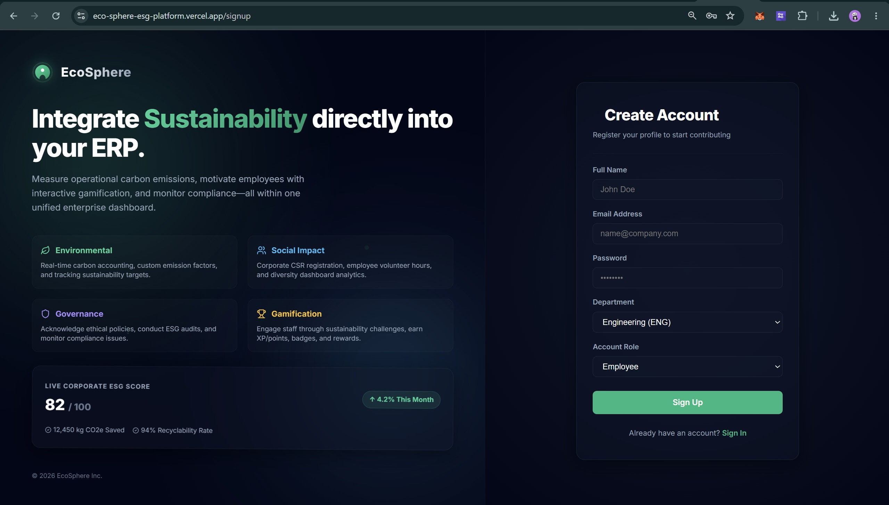
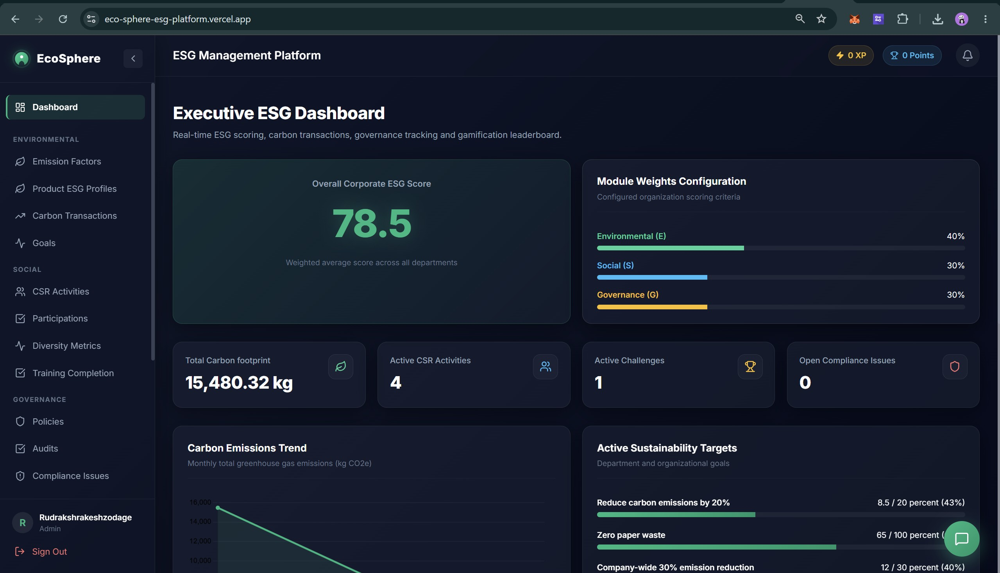
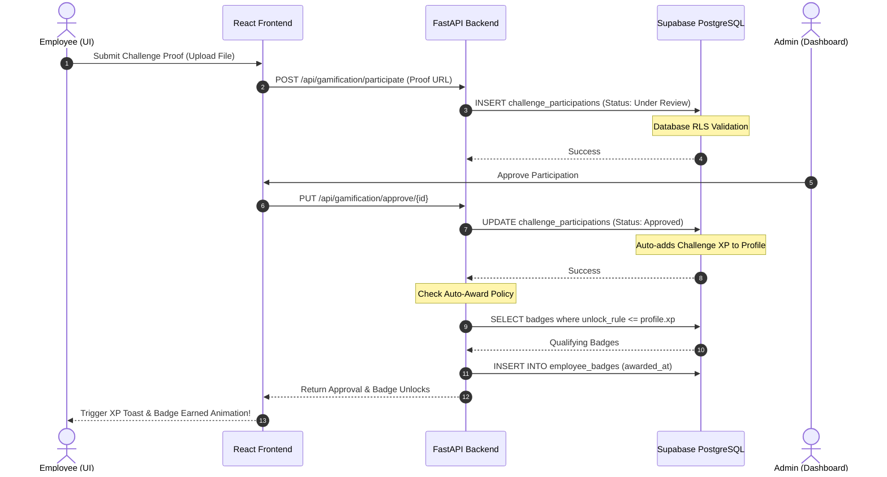

# <p align="center"> EcoSphere: Corporate ESG Management & Engagement Platform</p>

<p align="center">
  <strong>EcoSphere</strong> is a premium, full-stack enterprise platform that integrates Environmental, Social, and Governance (ESG) tracking directly into daily ERP operations, driving corporate sustainability through interactive employee gamification.
</p>

<p align="center">
  <a href="#"></a>
  <a href="#"></a>
  <a href="#"></a>
  <a href="#"></a>
  <a href="#"></a>
  <a href="#"></a>
</p>

---

## 🖼️ Application Demos & Screenshots

### 1. Main ESG Dashboard Overview


### 2. Leaderboard & Gamification Panel


---

## 📊 Workflow: Challenge & Badge Auto-Unlock Engine

The sequence diagram below displays the real-time workflow for employees completing ESG challenges, database updates, and automated badge progression:



---

## 🚀 Core Modules

### 🍀 Environmental
*   **Emission Factors Engine**: Configure multipliers (Electricity, Diesel, Petrol, Manufacturing) to compute greenhouse gas (GHG) output.
*   **Product ESG Profiles**: Monitor individual product carbon footprints, recyclability percentages, and sustainability ratings.
*   **Carbon Accounting**: Log transactional corporate emissions by department.
*   **Goals Tracking**: Keep tabs on long-term net-zero goals.

### 👥 Social Impact
*   **CSR Activities**: Register community volunteering initiatives.
*   **Hours Tracking**: Log employee participation, hours contributed, and support uploads.
*   **Diversity Analytics**: Analyze corporate diversity metrics in real time.

### 🛡️ Governance & Compliance
*   **ESG Policies**: Distribute company codes of conduct.
*   **Policy Acknowledgements**: Log electronic employee sign-offs.
*   **Auditing & Compliance**: Raise issue tickets with assigned owners, due dates, and action histories.

### 🏆 Gamification
*   **XP & Points**: Earn experience points for taking sustainable actions.
*   **Leaderboard**: Monthly rankings of top-performing departments and employees.
*   **Badge Auto-Award**: Automatic badge unlocking when user milestone criteria are met.
*   **Rewards Catalog**: Redeem earned points for physical or digital eco-friendly rewards.

---

## 🔌 API Endpoint Documentation

### Auth
*   `GET /api/auth/profile`: Get the current logged-in user profile.
*   `PUT /api/auth/profile`: Update the current logged-in user profile attributes.
*   `POST /api/auth/signup`: Register a new user and auto-confirm using admin client.

### Departments
*   `GET /api/departments`: List all active departments.
*   `POST /api/departments`: Create a new department.
*   `GET /api/departments/{department_id}`: Fetch details for a specific department.
*   `PUT /api/departments/{department_id}`: Update department configuration.
*   `DELETE /api/departments/{department_id}`: Deactivate/delete a department.

### Categories
*   `GET /api/categories`: List all categories.
*   `POST /api/categories`: Create a new category (CSR / Challenges scope).
*   `PUT /api/categories/{category_id}`: Update category attributes.
*   `DELETE /api/categories/{category_id}`: Delete a category.

### Environmental (Carbon & Goals)
*   `GET /api/environmental/emission-factors`: List current emission factors.
*   `POST /api/environmental/emission-factors`: Register a new emission factor.
*   `PUT /api/environmental/emission-factors/{ef_id}`: Update factor configurations.
*   `DELETE /api/environmental/emission-factors/{ef_id}`: Delete an emission factor.
*   `GET /api/environmental/carbon-transactions`: Logged carbon transactions list.
*   `POST /api/environmental/carbon-transactions`: Log a carbon transaction.
*   `DELETE /api/environmental/carbon-transactions/{ct_id}`: Delete a transaction.
*   `GET /api/environmental/goals`: List corporate targets.
*   `POST /api/environmental/goals`: Create a sustainability goal.
*   `PUT /api/environmental/goals/{goal_id}`: Update goal targets and status.
*   `GET /api/environmental/dashboard`: Get Environmental dashboard metrics.

### Social (CSR & Training)
*   `GET /api/social/csr-activities`: List CSR volunteering opportunities.
*   `POST /api/social/csr-activities`: Register a new CSR volunteering activity.
*   `PUT /api/social/csr-activities/{activity_id}`: Update CSR campaign details.
*   `DELETE /api/social/csr-activities/{activity_id}`: Delete a CSR activity.
*   `GET /api/social/participations`: List volunteer activity claims.
*   `POST /api/social/participations`: Submit a CSR volunteer activity claim.
*   `PUT /api/social/participations/{participation_id}/approve`: Approve/reject participation.
*   `GET /api/social/diversity`: Retrieve corporate diversity analytics.
*   `GET /api/social/training`: List employee course completions.
*   `POST /api/social/training`: Record a training certification completion.
*   `DELETE /api/social/training/{completion_id}`: Delete a training certification record.

### Governance
*   `GET /api/governance/policies`: List corporate policies.
*   `POST /api/governance/policies`: Publish a new policy.
*   `PUT /api/governance/policies/{policy_id}`: Update policy documents.
*   `DELETE /api/governance/policies/{policy_id}`: Delete policy records.
*   `GET /api/governance/policy-acknowledgements`: Get policy sign-offs.
*   `POST /api/governance/policy-acknowledgements`: Submit policy electronic sign-off.
*   `GET /api/governance/audits`: List auditing schedules.
*   `POST /api/governance/audits`: Create a new audit record.
*   `PUT /api/governance/audits/{audit_id}`: Update audit progress.
*   `GET /api/governance/compliance-issues`: List compliance tickets.
*   `POST /api/governance/compliance-issues`: Create a compliance ticket.
*   `PUT /api/governance/compliance-issues/{issue_id}`: Update compliance ticket state.

### Gamification & Badges
*   `GET /api/gamification/challenges`: List active challenges.
*   `POST /api/gamification/challenges`: Create a new challenge.
*   `PUT /api/gamification/challenges/{challenge_id}`: Update challenge parameters.
*   `PUT /api/gamification/challenges/{challenge_id}/status`: Toggle active status.
*   `GET /api/gamification/challenge-participations`: List challenge claims.
*   `POST /api/gamification/challenge-participations`: Join/submit proof for a challenge.
*   `PUT /api/gamification/challenge-participations/{cp_id}/approve`: Approve/reject challenge claim.
*   `GET /api/gamification/badges`: List badges.
*   `POST /api/gamification/badges`: Register a new badge.
*   `GET /api/gamification/badges/my`: Get unlocked badges.
*   `GET /api/gamification/rewards`: List rewards.
*   `POST /api/gamification/rewards`: Register a reward.
*   `POST /api/gamification/rewards/{reward_id}/redeem`: Redeem a reward.
*   `GET /api/gamification/leaderboard`: Get rankings.

### Reports (High-Fidelity PDF Generation)
*   `POST /api/reports/generate`: Generates high-fidelity landscapes side-by-side comparative PDF reports.

### Notifications
*   `GET /api/notifications`: Retrieve unread/read notifications.
*   `GET /api/notifications/unread-count`: Get unread notification counts.
*   `PUT /api/notifications/{notification_id}/read`: Mark notification as read.
*   `PUT /api/notifications/read-all`: Mark all notifications as read.

### Settings
*   `GET /api/settings`: Get ESG settings parameters.
*   `PUT /api/settings`: Update settings parameters.

### Products
*   `GET /api/products`: List product ESG profiles.
*   `POST /api/products`: Create a product ESG profile.
*   `PUT /api/products/{product_id}`: Update product profiles.
*   `DELETE /api/products/{product_id}`: Delete product profiles.

---

## ⚙️ Installation & Configuration

### Prerequisites
*   [Node.js](https://nodejs.org/) (v18+)
*   [Python](https://www.python.org/) (v3.10+)
*   A [Supabase](https://supabase.com/) account.

### 1. Database Setup
1.  Navigate to your **Supabase Dashboard** > **SQL Editor**.
2.  Copy and execute the contents of [`supabase/migrations/001_initial_schema.sql`](file:///d:/Rudraksh/College/app/EcoSphere-ESG-Platform/supabase/migrations/001_initial_schema.sql) to set up tables, functions, and initial schema.
3.  Execute the seed script [`supabase/seed.sql`](file:///d:/Rudraksh/College/app/EcoSphere-ESG-Platform/supabase/seed.sql) to load initial categories and departments.
4.  Create a public storage bucket in Supabase named `evidence`.

### 2. Configuration Setup
Create a `.env` file at the **project root** containing:
```env
SUPABASE_URL=https://your-project-id.supabase.co
SUPABASE_ANON_KEY=your-anon-public-key
SUPABASE_SERVICE_ROLE_KEY=your-service-role-key

VITE_SUPABASE_URL=https://your-project-id.supabase.co
VITE_SUPABASE_ANON_KEY=your-anon-public-key
VITE_API_URL=http://localhost:8000/api
SECRET_KEY=your-secret-key-phrase
CORS_ORIGINS=http://localhost:5173,http://localhost:5174
```

### 3. Disable Email Confirmation (Local Testing Bypass)
To enable instant, direct user signup and login without requiring email verification:
1.  Go to **Supabase Dashboard** ➔ **Authentication** ➔ **Sign In / Providers**.
2.  Expand **Email** provider.
3.  Toggle **OFF** `Confirm email` and click **Save** at the bottom of the Email card.

### 4. Running Locally

#### Run Backend:
```bash
cd backend
python -m venv venv
venv\Scripts\activate
pip install -r requirements.txt
uvicorn app.main:app --reload --port 8000
```

#### Run Frontend:
```bash
cd frontend
npm install
npm run dev -- --port 5174
```