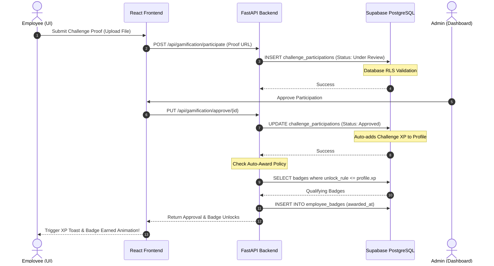

# <p align="center"> EcoSphere: Corporate ESG Management & Engagement Platform</p>

<p align="center">
  <strong>EcoSphere</strong> is a premium, full-stack enterprise platform that integrates Environmental, Social, and Governance (ESG) tracking directly into daily ERP operations, driving corporate sustainability through interactive employee gamification.
</p>

<p align="center">
  <a href="#"></a>
  <a href="#"></a>
  <a href="#"></a>
  <a href="#"></a>
  <a href="#"></a>
  <a href="#"></a>
  <a href="#"></a>
</p>


## 📊 Workflow: Challenge & Badge Auto-Unlock Engine

The sequence diagram below displays the real-time workflow for employees completing ESG challenges, database updates, and automated badge progression:



---

## 🚀 Core Modules

### 🍀 Environmental
*   **Emission Factors Engine**: Configure multipliers (Electricity, Diesel, Petrol, Manufacturing) to compute greenhouse gas (GHG) output.
*   **Product ESG Profiles**: Monitor individual product carbon footprints, recyclability percentages, and sustainability ratings.
*   **Carbon Accounting**: Log transactional corporate emissions by department.
*   **Goals Tracking**: Keep tabs on long-term net-zero goals.

### 👥 Social Impact
*   **CSR Activities**: Register community volunteering initiatives.
*   **Hours Tracking**: Log employee participation, hours contributed, and support uploads.
*   **Diversity Analytics**: Analyze corporate diversity metrics in real time.

### 🛡️ Governance & Compliance
*   **ESG Policies**: Distribute company codes of conduct.
*   **Policy Acknowledgements**: Log electronic employee sign-offs.
*   **Auditing & Compliance**: Raise issue tickets with assigned owners, due dates, and action histories.

### 🏆 Gamification
*   **XP & Points**: Earn experience points for taking sustainable actions.
*   **Leaderboard**: Monthly rankings of top-performing departments and employees.
*   **Badge Auto-Award**: Automatic badge unlocking when user milestone criteria are met.
*   **Rewards Catalog**: Redeem earned points for physical or digital eco-friendly rewards.

---

## ⚙️ Installation & Configuration

### Prerequisites
*   [Node.js](https://nodejs.org/) (v18+)
*   [Python](https://www.python.org/) (v3.10+)
*   A [Supabase](https://supabase.com/) account.

### 1. Database Setup
1.  Navigate to your **Supabase Dashboard** > **SQL Editor**.
2.  Copy and execute the contents of [`supabase/migrations/001_initial_schema.sql`](file:///d:/Rudraksh/College/app/EcoSphere-ESG-Platform/supabase/migrations/001_initial_schema.sql) to set up tables, functions, and initial schema.
3.  Execute the seed script [`supabase/seed.sql`](file:///d:/Rudraksh/College/app/EcoSphere-ESG-Platform/supabase/seed.sql) to load initial categories and departments.
4.  Run the helper script [`scratch/enable_product_policies.sql`](file:///C:/Users/Rudraksh/.gemini/antigravity-ide/brain/3e133200-cf36-4f26-92c1-0a739c056788/scratch/enable_product_policies.sql) in your SQL editor to enable Product Profiles security policies.
5.  Create a public storage bucket in Supabase named `evidence`.

### 2. Configuration Setup
Create a `.env` file at the **project root** containing:
```env
SUPABASE_URL=https://your-project-id.supabase.co
SUPABASE_ANON_KEY=your-anon-public-key
SUPABASE_SERVICE_ROLE_KEY=your-service-role-key

VITE_SUPABASE_URL=https://your-project-id.supabase.co
VITE_SUPABASE_ANON_KEY=your-anon-public-key
VITE_API_URL=http://localhost:8000/api

SECRET_KEY=your-jwt-signing-secret
CORS_ORIGINS=http://localhost:5173,http://localhost:5174
```

Copy the `.env` file into the `/frontend` directory to allow Vite to initialize correctly.

### 3. Execution

#### Backend (FastAPI)
```bash
cd backend
python -m venv venv
# On Windows
.\venv\Scripts\activate
# On macOS/Linux
source venv/bin/activate

pip install -r requirements.txt
uvicorn app.main:app --reload --port 8000
```
Interactive docs will load at [http://localhost:8000/docs](http://localhost:8000/docs).

#### Frontend (React + Vite)
```bash
cd frontend
npm install
npm run dev
```
The dev server will run on [http://localhost:5173](http://localhost:5173) or [http://localhost:5174](http://localhost:5174).

---

## 🔒 Security Architecture
All data transactions are governed via **PostgreSQL Row Level Security (RLS)** to enforce corporate compliance:
*   **Profiles**: Public reading; updates allowed only by owner or admins.
*   **Carbon Ledger**: Selectable by anyone; mutable only by Admin roles.
*   **Gamification Redemptions**: Handled via transaction locks to prevent double-spending points during reward redemptions.
<!-- deploy trigger: 1 -->